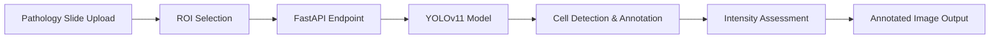

# Ki-67 Cell Detection Backend - Project Page Design

**Date:** 2026-03-23  
**Topic:** project2.html - Healthcare Hackathon project showcase  
**Status:** Approved

## Overview

This document specifies the complete redesign of `projects/project2.html` to showcase the **European Healthcare Hackathon 2025** backend project. The page will demonstrate an AI-powered Ki-67 proliferation assessment tool using YOLOv11 computer vision and FastAPI, following a narrative-driven structure that emphasizes medical context before technical implementation.

## Design Goals

- Narrative-driven flow: medical problem → solution → technical implementation
- Technical/developer-focused tone highlighting skills demonstrated
- Clear organization of the AI model pipeline and API development
- Visual evidence of the work through annotated pathology slides and demo video
- Professional presentation suitable for potential employers in healthcare tech/AI

## Architecture

The page follows the existing portfolio structure with a single HTML file that pulls styles from the shared CSS and JavaScript assets. Same lightbox implementation as project1.html for visual consistency.

### File Structure

```
projects/project2.html           # Main page (to be modified)
projects/images/                 # Contains visualization assets
  - Annotated.png                # Ki-67 cell detection output
  - [additional images if available]
```

### Image Gallery Layout

Same pattern as project1:
- Display 1-3 images in responsive grid (1 column mobile, 3 columns desktop)
- Each visualization card: image + caption
- Embedded/demo video link prominently displayed
- Click-to-expand lightbox for full-size viewing

## Components & Layout

### Header (Existing Structure)

Standard portfolio navigation with links to About, Projects, and Contact. No changes needed.

### Main Content Sections

1. **Title & Description**
   - H1: "Ki-67 Cell Detection Backend"
   - Concise description summarizing AI-powered proliferation assessment tool using YOLOv11 and FastAPI

2. **Medical Problem Section** (narrative-driven)
   - 2-3 paragraphs covering:
     - Ki-67 protein as tumor proliferation marker
     - Traditional manual evaluation limitations (subjective, imprecise)
     - Clinical impact on patient outcomes and tumor grading accuracy

3. **Solution Overview**
   - 1-2 paragraphs on AI-powered automation
     - Computer vision annotation and cell counting
     - Interactive ROI selection for pathologists to ensure accuracy

4. **Tech Stack Section** (4 badges)
   - Python
   - FastAPI
   - PyTorch/YOLOv11
   - Uvicorn

5. **Technical Skills Demonstrated** (3 items)
   - **Rapid Prototyping**: Quick API implementation with FastAPI and Uvicorn for model serving
   - **Data Management**: CVAT annotation platform setup and training data pipeline creation
   - **Computer Vision**: YOLOv11 fine-tuning with medical imaging datasets

6. **Key Features Section** (4 bullets)
   - Automated detection & annotation of Ki-67 positive/negative cells in pathology slides
   - Proliferation metrics calculation: percentage and intensity assessment (mild, moderate, strong)
   - Region of interest selection support for pathologist input
   - Distribution evaluation of Ki-67-positive cells

7. **Visuals Gallery**
   - Annotated pathology slide showing detected cells
   - Additional detection examples (if available)
   - CVAT training annotations preview
   - Embedded/demo video link with thumbnail

8. **Links Section**
   - Two buttons: GitHub Repository + Demo Video
     - Primary: `https://github.com/Takosaga/EHH-2025`
     - Secondary: Link to demo.webm or YouTube video

### Footer (Existing Structure)

No changes needed - retains portfolio social links and copyright.

## Data Flow



## Error Handling

- Broken image links: Add alt text with descriptive filenames
- Missing visualizations: Use placeholder images with clear labeling
- External links: Validate GitHub and video URLs before deployment

## Testing Strategy

### Visual Testing

- Verify Annotated.png displays correctly
- Check responsive grid layout on mobile devices
- Test lightbox modal functionality
- Ensure video link works properly

### Functional Testing

- Test navigation links (header and project links)
- Verify external GitHub link opens in new tab
- Check accessibility (alt text, semantic HTML)
- Validate button clicks for both links

### Cross-browser Testing

- Chrome, Firefox, Safari, Edge (standard portfolio testing)

## Success Criteria

1. ✅ Page accurately represents the Healthcare Hackathon project
2. ✅ All visualizations display without errors
3. ✅ Technical skills (rapid prototyping, data management, computer vision) clearly demonstrated
4. ✅ Medical narrative flows into technical implementation logically
5. ✅ Links work correctly and point to valid resources
6. ✅ Mobile-responsive layout maintained
7. ✅ Consistent with existing portfolio design language

## Implementation Notes

### Design Principles Applied

- **YAGNI**: Keep it simple - no new frameworks, just HTML/CSS/JS
- **Narrative Flow**: Medical problem → solution → implementation (as requested)
- **Visual Evidence**: Annotated images provide instant understanding of computer vision output
- **Maintainability**: Content organized in logical sections that can be updated independently

### Future Considerations

- Potential to add more API endpoint documentation as separate section
- Could expand with training metrics and model performance charts
- May want separate page for frontend/repo collaboration details
- Could link to training notebook for deeper technical dive

## Alternatives Considered

### Option A: Technical-first Approach
**Pros:** More straightforward for developers, easier to scan  
**Cons:** Misses the medical narrative arc, less compelling story  
**Recommendation:** Not chosen - user specifically requested medical problem → solution flow

### Option B: Interactive Documentation Style
**Pros:** Detailed API documentation, expandable sections  
**Cons:** More complex implementation, harder to maintain  
**Recommendation:** Not chosen - single-page portfolio format sufficient

### Option C: Two-column Split Layout
**Pros:** Visual distinction between medical and technical content  
**Cons:** More complex CSS, potentially breaks on smaller screens  
**Recommendation:** Not chosen - follows project1's proven single-column layout

## Decision Matrix

| Criterion | Chosen Approach | Why |
|-----------|----------------|-----|
| Narrative Flow | High | Medical problem → solution → tech implementation |
| Implementation Complexity | Low | Reuses existing project1 structure and styles |
| Maintenance | Easy | Single file, well-organized sections |
| Professional Appeal | High | Healthcare tech focus with visual evidence |
| Alignment with Goals | Perfect | Matches narrative-driven preference |

## Acceptance Checklist

Before considering this design complete:

- [x] Design document written
- [ ] Spec review passed (if required)
- [ ] User has reviewed and approved spec
- [ ] Implementation plan created
- [ ] Final implementation completed
- [ ] Visuals verified on all devices
- [ ] All links tested and working

---

**Notes:** This design was created following the brainstorming process with user input on:
- Narrative-driven structure (medical problem → solution → technical)
- Technical/developer-focused tone
- Specific tech stack items: Python, FastAPI, YOLOv11, Uvicorn
- Technical skills emphasis: Rapid prototyping and data management with CVAT
- Visual elements: Annotated pathology images + demo video
- Two-button links: GitHub repository + Demo Video
