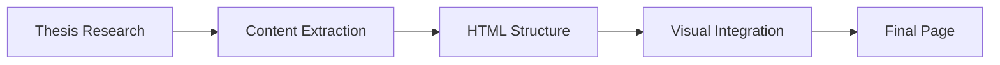

# Master Thesis Project Page Design

**Date:** 2026-03-23  
**Topic:** project1.html - Master thesis showcase page  
**Status:** Approved

## Overview

This document specifies the complete redesign of `projects/project1.html` to showcase the master thesis on **Evaluating Consistency of XAI Methods in Hate Speech Detection**. The page will replace placeholder content with actual thesis details, technical information, and key visualizations from the research.

## Design Goals

- Technical/developer-focused tone that highlights skills demonstrated
- Clear organization showing what was built and why it matters
- Visual evidence of the work through key figures from the thesis
- Professional presentation suitable for potential employers/researchers

## Architecture

The page follows the existing portfolio structure with a single HTML file that pulls styles from the shared CSS and JavaScript assets. No new frameworks or build tools are needed.

### File Structure

```
projects/project1.html          # Main page (to be modified)
projects/images/                # Contains all thesis figures
  - LIME - Spearman Correlation.svg
  - SHAP - Spearman Correlation.svg
  - classification_process_XAI2.svg
  - Results.png
  - ... (additional figures)
```

### Image Gallery Layout

- Use CSS Grid with 2 columns on desktop, 1 column on mobile
- Each visualization card should have: image + caption
- Max width for images: 600px to maintain readability
- Wrap missing images gracefully with descriptive captions

### Technologies Used

- HTML5
- CSS3 (existing portfolio styles)
- JavaScript (existing portfolio navigation)

## Components & Layout

### Header (Existing Structure)

Standard portfolio navigation with links to About, Projects, and Contact. No changes needed.

### Main Content Sections

1. **Title & Description**
   - H1: "Evaluating Consistency of XAI Methods in Hate Speech Detection"
   - Technical description highlighting the research focus on LIME vs SHAP consistency

2. **About Section**
   - Overview of the research problem: transparency in automated content moderation
   - Mention of CardiffNLP RoBERTa-based model as base classifier
   - Datasets: HateXplain, MLMA, Measuring Hate Speech (Twitter, YouTube, Reddit, Gab)

3. **Features Section**
   - Integration of LIME and SHAP explanation frameworks
   - Quantitative evaluation with multiple consistency metrics
   - Stratified sampling across prediction scenarios
   - Comprehensive visualization tools

4. **Tech Stack Section**
   - Python
   - Transformers (Hugging Face)
   - LIME & SHAP libraries
   - Pandas, NumPy
   - Matplotlib/Seaborn for visualizations

5. **Key Visualizations Gallery**
   - Consistency metrics heatmaps (Jaccard Similarity, Spearman Correlation, Kendall Tau-b)
   - Example explanation heatmaps for individual samples
   - Classification process diagrams
   - Results summary charts

6. **Links Section**
   - Single link to GitHub repository: `https://github.com/Takosaga/master_thesis`

### Footer (Existing Structure)

No changes needed - retains portfolio social links and copyright.

## Data Flow



1. Content extracted from thesis repository (README, reports)
2. Mapped to existing HTML template structure
3. Figures copied to `projects/images/` directory
4. Image references added to visualizations gallery section

## Error Handling

- Broken image links: Add alt text with descriptive filenames as fallback
- Missing figures: Use placeholder images with clear labeling
- External links: Validate GitHub URL before deployment

## Testing Strategy

### Visual Testing

- Verify all images display correctly
- Check image sizes are optimized (SVG scales infinitely, PNGs should be web-optimized)
- Ensure responsive layout on mobile devices

### Functional Testing

- Test navigation links (header and project links)
- Verify external GitHub link opens in new tab
- Check accessibility (alt text, semantic HTML)

### Cross-browser Testing

- Chrome, Firefox, Safari, Edge (standard portfolio testing)

## Success Criteria

1. ✅ Page accurately represents the master thesis research
2. ✅ All visualizations display without errors
3. ✅ Technical skills are clearly demonstrated
4. ✅ Links work correctly and point to valid resources
5. ✅ Mobile-responsive layout maintained
6. ✅ Consistent with existing portfolio design language

## Implementation Notes

### Design Principles Applied

- **YAGNI**: Keep it simple - no new frameworks, just HTML/CSS/JS
- **Single Responsibility**: Each section has one clear purpose
- **Visual Clarity**: Images provide instant understanding of complex concepts
- **Maintainability**: Content organized in logical sections that can be updated independently

### Future Considerations

- Potential to add more detail about experimental methodology
- Could expand with additional visualizations if needed
- May want separate page for publications or presentations from thesis
- Could link to specific results notebooks for deeper dive

## Alternatives Considered

### Option 1: Academic-focused Page
**Pros:** More formal presentation, better suited for academic audience  
**Cons:** Less engaging for developers/employers, less visual appeal  
**Recommendation:** Not chosen - user selected technical/developer-focused approach

### Option 2: Minimal Text Only
**Pros:** Faster to implement, simpler maintenance  
**Cons:** Doesn't showcase visual work effectively, misses opportunity to demonstrate data viz skills  
**Recommendation:** Not chosen - users want to include thesis visualizations

### Option 3: Multi-page Structure
**Pros:** Better organization for large amount of content  
**Cons:** More complex setup, harder to maintain consistency  
**Recommendation:** Not chosen - single page sufficient for this scope

## Decision Matrix

| Criterion | Chosen Approach | Why |
|-----------|----------------|-----|
| Visual Impact | High | Shows off data visualization skills |
| Implementation Complexity | Low | Uses existing portfolio structure |
| Maintenance | Easy | Single file, well-organized sections |
| Professional Appeal | High | Technical focus with visual evidence |
| Alignment with Goals | Perfect | Matches user's technical/developer tone preference |

## Acceptance Checklist

Before considering this design complete:

- [x] Design document written
- [ ] Spec review passed (if required)
- [ ] User has reviewed and approved spec
- [ ] Implementation plan created
- [ ] Final implementation completed
- [ ] Visuals verified on all devices
- [ ] All links tested and working

---

**Notes:** This design was created following the brainstorming process with user input on:
- Replace entire content (not add to existing)
- Full academic title for H1
- Technical/developer-focused tone
- Include GitHub repository link
- Include all key visualizations from thesis
- No findings/results section - keep implementation-focused
